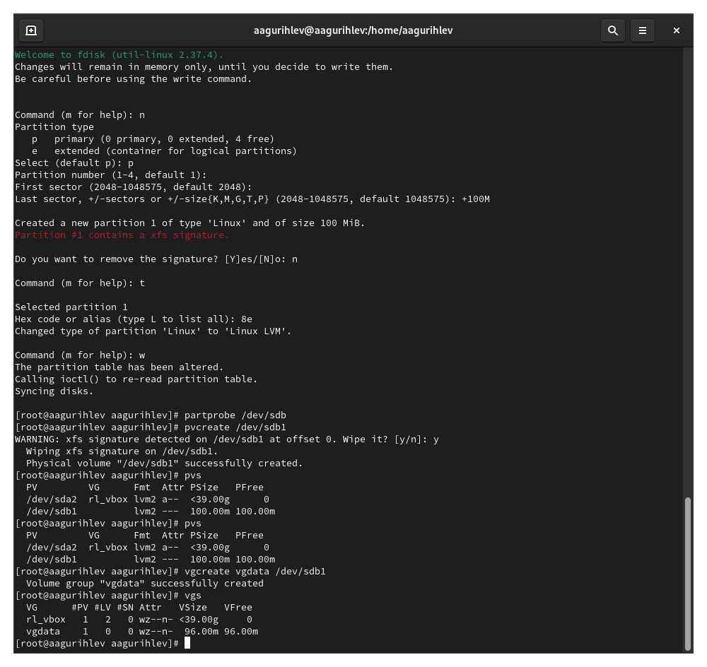

---
## Front matter
title: "Лабораторная работа №15"
subtitle: "Управление логическими томами"
author: "Гурылев Артем Андреевич"

## Generic otions
lang: ru-RU
toc-title: "Содержание"

## Bibliography
bibliography: bib/cite.bib
csl: pandoc/csl/gost-r-7-0-5-2008-numeric.csl

## Pdf output format
toc: true # Table of contents
toc-depth: 2
lof: true # List of figures
lot: true # List of tables
fontsize: 12pt
linestretch: 1.5
papersize: a4
documentclass: scrreprt
## I18n polyglossia
polyglossia-lang:
  name: russian
  options:
	- spelling=modern
	- babelshorthands=true
polyglossia-otherlangs:
  name: english
## I18n babel
babel-lang: russian
babel-otherlangs: english
## Fonts
mainfont: PT Serif
romanfont: PT Serif
sansfont: PT Sans
monofont: PT Mono
mainfontoptions: Ligatures=TeX
romanfontoptions: Ligatures=TeX
sansfontoptions: Ligatures=TeX,Scale=MatchLowercase
monofontoptions: Scale=MatchLowercase,Scale=0.9
## Biblatex
biblatex: true
biblio-style: "gost-numeric"
biblatexoptions:
  - parentracker=true
  - backend=biber
  - hyperref=auto
  - language=auto
  - autolang=other*
  - citestyle=gost-numeric
## Pandoc-crossref LaTeX customization
figureTitle: "Рис."
tableTitle: "Таблица"
listingTitle: "Листинг"
lofTitle: "Список иллюстраций"
lotTitle: "Список таблиц"
lolTitle: "Листинги"
## Misc options
indent: true
header-includes:
  - \usepackage{indentfirst}
  - \usepackage{float} # keep figures where there are in the text
  - \floatplacement{figure}{H} # keep figures where there are in the text
---

# Цель работы

Целью работы является получение навыков управления логическими томами.

# Выполнение лабораторной работы

Для начала отмонтируем два диска, с которыми мы работали в предыдущей лабораторной работе, и убедимся, что они не подмонтированы(рис. [-@fig:001]):

{#fig:001 width=70%}

Подготовим диск /dev/sdb для работы, удалив на нём предыдущие партиции с помощью fdisk, и проверим выполнение наших действий командой cat(рис. [-@fig:002]):

{#fig:002 width=70%}

Затем с помощью утилиты fdisk создадим новый раздел на 100M типа Linux LVM(рис. [-@fig:003]):

{#fig:003 width=70%}

Запишем изменения, после чего создадим физический том LVM, и проверим, успешно ли его создание командой pvs(рис. [-@fig:004]):

{#fig:004 width=70%}

Создадим группу томов vgdata, и проверим её свойства с помощью команды vgs(рис. [-@fig:005]):

{#fig:005 width=70%}

Введём pvs, чтобы проверить, что теперь физический том принадлежит к группе vgdata. После этого создадим логический том lvdata, занимающий 50% свободного пространства группы vgdata(рис. [-@fig:006]):

{#fig:006 width=70%}

Создадим файловую систему ext4 поверх логического диска, создадим папку для монтирования. Добавим в fstab строку для автоматического монтирования логического тома(рис. [-@fig:007]):

{#fig:007 width=70%}

(рис. [-@fig:005]):

{#fig:005 width=70%}

(рис. [-@fig:005]):

{#fig:005 width=70%}

(рис. [-@fig:005]):

{#fig:005 width=70%}

(рис. [-@fig:005]):

{#fig:005 width=70%}

(рис. [-@fig:005]):

{#fig:005 width=70%}

(рис. [-@fig:005]):

{#fig:005 width=70%}	

# Выполнение самостоятельной работы

# Выводы

В этой работе я научился использовать циклы и ветвления для более эффективного программирования в OC UNIX.

